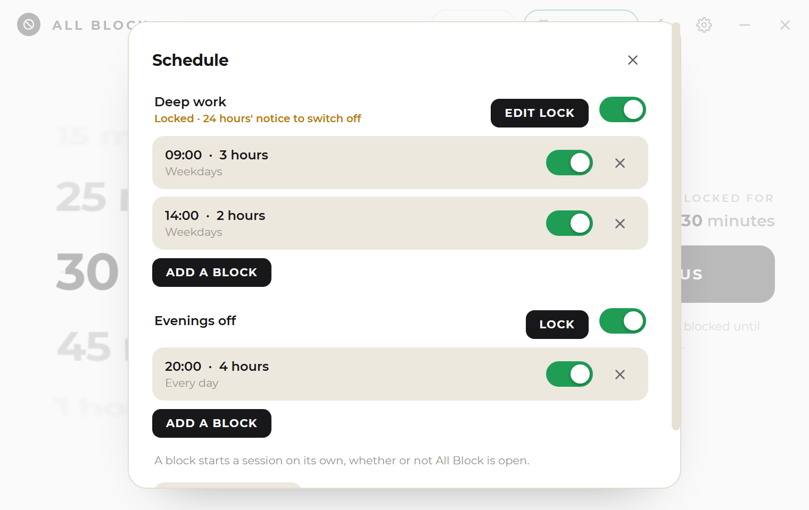
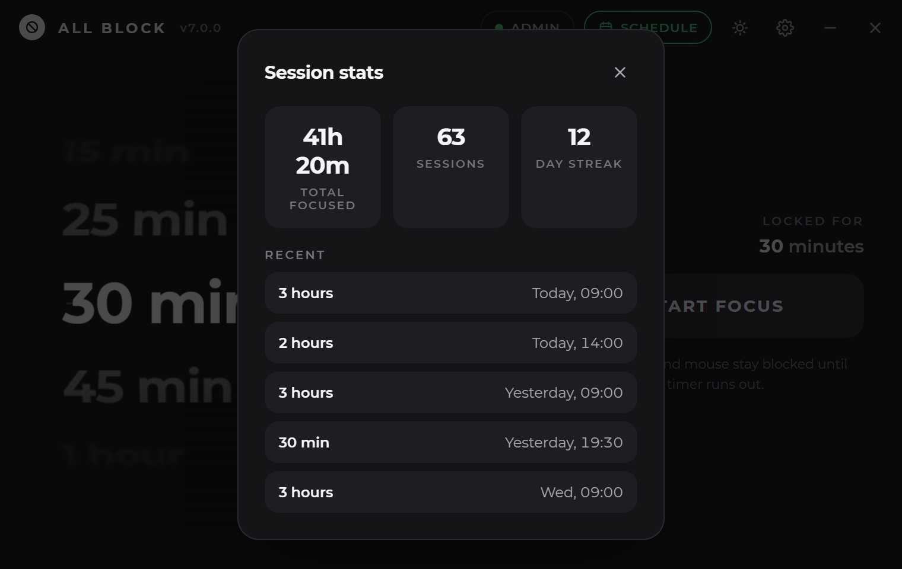

<div align="center">


# All Block

**A ruthless Windows focus timer.**

[](#)
[](#)
[](LICENSE)
[](#)

</div>

---

## Screenshots

<table>
<tr>
<td align="center" width="50%">
<br>
<sub>Main screen — dark mode</sub>
</td>
<td align="center" width="50%">
<br>
<sub>Main screen — light mode</sub>
</td>
</tr>
<tr>
<td align="center" width="50%">
<br>
<sub>Routines — blocks grouped, and locked</sub>
</td>
<td align="center" width="50%">
<br>
<sub>Stats — totals, streak, recent sessions</sub>
</td>
</tr>
<tr>
<td align="center" width="50%">
<br>
<sub>One-time setup wizard</sub>
</td>
<td align="center" width="50%">
<br>
<sub>Fullscreen lock, mid-session — still Tkinter</sub>
</td>
</tr>
</table>

## What this is

The current build of [All Block](https://github.com/Auzeo/all-block), replacing
the older Tkinter version. Same behaviour, same palette, same sounds — the
window is drawn by the WebView2 renderer instead of Tkinter, so the wheel, the
modals and the type render the way a browser renders them rather than the way
a canvas can be talked into.

`IS_THE_RELEASE` in `core.py` is the switch that made this the release: it's
`True` now, which points the AppUserModelID, the `~/.allblock` data folder,
the `AllBlockResume` startup entry and the shortcut name at the original
identity, so anyone upgrading from the Tkinter build keeps their history,
streak and schedules. The exe ships as `All Block.exe` (set in
`All Block HTML.spec`), with no `HTML` in the name anywhere a user sees it.

## Features

- **A real lockout.** A session disables the mouse and keyboard system-wide, not
  just in this app. There's no pause and no cancel button.
- **Any length from 10 seconds to 3 hours,** picked on a scroll wheel.
- **A way out that costs something.** Hold <kbd>Esc</kbd> for five seconds to end
  a session early. Escapes are counted per month, and the lock screen shows how
  many are left.
- **Routines.** Group blocks — written as a span, 09:00 until 12:00, plus the days
  it runs — into a routine you can switch on or off as a set. A block runs up to
  three hours; past midnight is fine.
- **Locks on a routine.** Hold it until it next runs, freeze it to a date, or
  require 24 hours' notice before it can be switched off. Turning it off tomorrow
  is a decision you make today.
- **Windows keeps the appointment.** Each block is a real Task Scheduler trigger,
  so it fires whether or not All Block is open.
- **Catch-up.** If the PC was off when a block was due, the app offers you the
  one you missed next time you log in.
- **Survives a restart.** Rebooting mid-session doesn't end it — the app comes
  back up still locked, with the remaining time intact.
- **Light and dark,** following Windows, with a circular wipe between them.

## What changed, and what didn't

| | Tkinter build | This build |
|---|---|---|
| Main window | customtkinter | HTML + CSS in a frameless WebView2 window |
| Duration wheel | labels rasterised through Pillow each frame | CSS 3-D transforms on the compositor |
| Sounds | synthesised, played by pygame | synthesised, played by Web Audio |
| Lock overlay | Tkinter, fullscreen | **unchanged — still Tkinter** |
| Input blocking, schedules, resume, tray | identical code, moved to `core.py` | identical |

The lock overlay stays in Tkinter deliberately. It is the one screen that must
never fail to appear, and tkinter is in the standard library with nothing
between it and the window — a session you can escape because a renderer crashed
is not a session.

The window is a fixed 760×480. pywebview's frameless window has no native
resize grip, so this build can't be resized; the Tkinter one can.

## Layout

| File | What lives there |
|---|---|
| `AllBlockHTML.py` | entry point, session controller, and the JS bridge (`window.pywebview.api`) |
| `core.py` | everything with no UI: palettes, presets, persistence, hosts-file and app blocking, the input hooks, the tray icon, admin/elevation, formatting |
| `lockscreen.py` | the fullscreen Tkinter overlay, on its own thread |
| `sfx.py` | the sound set, synthesised at import and handed to the page as `data:` URIs |
| `ui/` | `index.html`, `app.css`, `app.js` |
| `assets/` | logo and the bundled Montserrat faces |

## Running from source

```
pip install -r requirements.txt
python AllBlockHTML.py
```

Windows 11 has the WebView2 runtime preinstalled. On older Windows 10 builds,
install the [Evergreen runtime](https://developer.microsoft.com/microsoft-edge/webview2/)
first.

The app relaunches itself elevated on start — blocking input system-wide needs
administrator rights.

## Building the exe

```
pyinstaller "All Block HTML.spec"
```

Output lands in `dist\All Block.exe`. The spec bundles `assets/` and `ui/`,
sets the icon, and marks the exe `uac_admin` so Windows asks for elevation up
front.

## Safety notes

A session genuinely disables your mouse and keyboard until the timer runs out.
Start one only when you're ready to lose input for that long.

Holding <kbd>Esc</kbd> for five seconds ends a session early. You get a small
number of those a month; the lock screen tells you how many are left.

<kbd>Ctrl</kbd>+<kbd>Alt</kbd>+<kbd>Del</kbd> is never blocked — Windows reserves
it — so Task Manager is always reachable. Holding
<kbd>Ctrl</kbd>+<kbd>P</kbd>+<kbd>L</kbd>+<kbd>M</kbd> together ends a session early.

## Credits

UI text is set in [Montserrat](https://github.com/JulietaUla/Montserrat)
(SIL Open Font License).

## License

All Rights Reserved. See [LICENSE](LICENSE). © Auzeo
