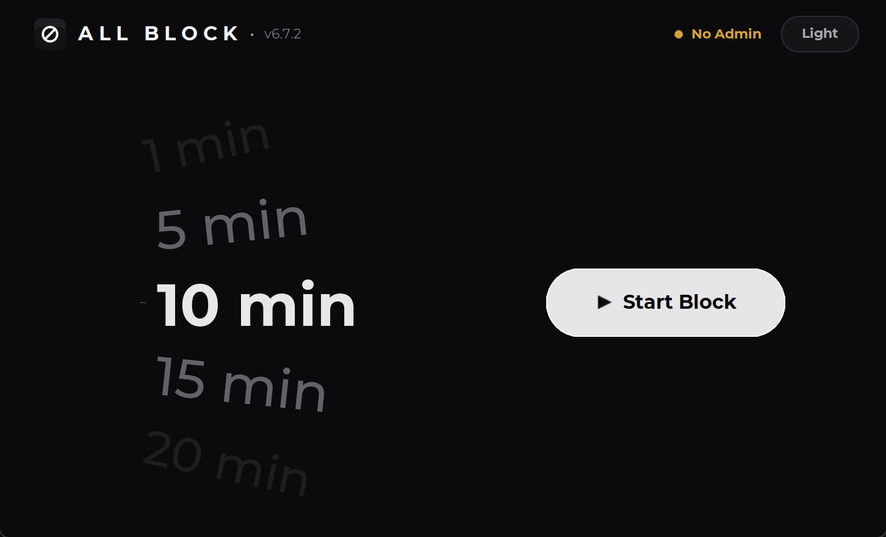
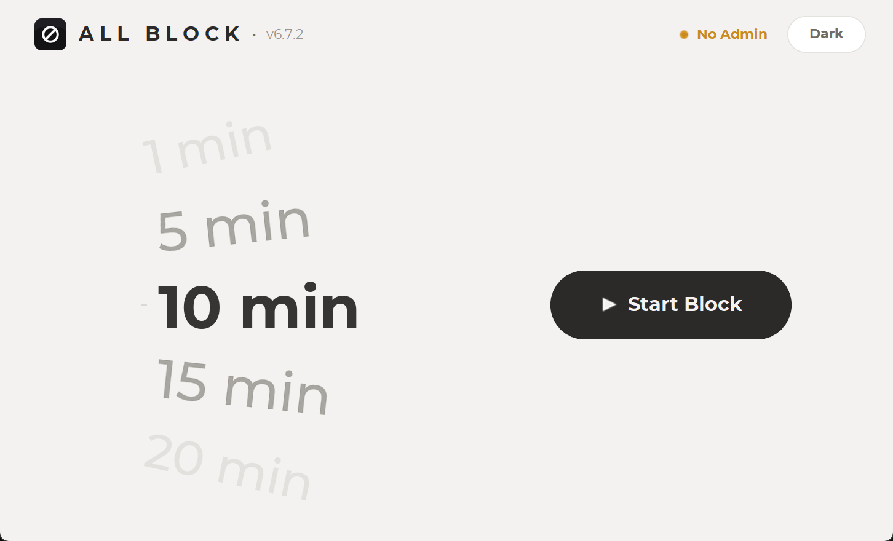
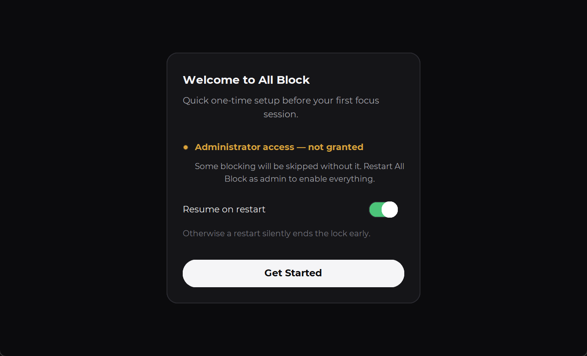
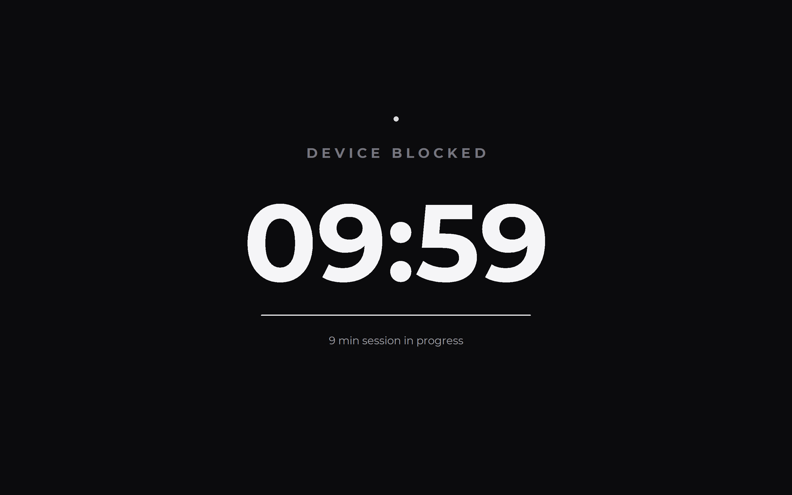

<div align="center">


# All Block

**A ruthless focus timer for Windows. Pick a duration, hit Start, and your keyboard and mouse are gone until the clock runs out.**

[](#)
[](#)
[](LICENSE)
[](#)

</div>

---

## Why All Block exists

Website blockers and app blockers are easy to argue with. You hit a paywall, you disable the extension, you're back on the site in ten seconds. All Block skips the negotiation: once a session starts, your mouse and keyboard stop working system‑wide, full stop, until the timer hits zero. There's no "just one more tab" — there's no input at all.

It's a single-purpose tool built around one idea: the only distraction blocker that actually works is one you can't casually click your way out of.

## Screenshots

<table>
<tr>
<td align="center" width="50%">
<br>
<sub>Main screen — dark mode</sub>
</td>
<td align="center" width="50%">
<br>
<sub>Main screen — light mode</sub>
</td>
</tr>
<tr>
<td align="center" width="50%">
<br>
<sub>One-time setup wizard</sub>
</td>
<td align="center" width="50%">
<br>
<sub>Fullscreen lock, mid-session</sub>
</td>
</tr>
</table>

## Features

- **Hard input lock** — low-level `WH_KEYBOARD_LL` / `WH_MOUSE_LL` Windows hooks swallow every mouse and keyboard event system-wide for the duration of a session, not just inside the app.
- **Fullscreen countdown** — a distraction-free, always-on-top lock screen shows exactly how much time is left, and re-asserts itself instantly if anything (Alt-Tab, a touchpad gesture, a display change) tries to shove it aside.
- **Flexible durations** — a smooth scroll-wheel picker from 10 seconds up to 3 hours, so you can use it for a quick test run or a full deep-work block.
- **Built-in emergency exit** — hold <kbd>Esc</kbd> for about 1.5 seconds, or press <kbd>Ctrl</kbd>+<kbd>P</kbd>, to end a session early. You're never truly trapped: even in the worst case, <kbd>Ctrl</kbd>+<kbd>Alt</kbd>+<kbd>Del</kbd> always reaches Task Manager.
- **Resume on restart** — if a reboot or forced restart happens mid-session, All Block picks the countdown back up where it left off instead of silently letting you off the hook.
- **Follows your Windows theme** — launches in light or dark mode to match your system setting automatically, with an animated circular wipe if you switch it manually.
- **Optional site & app blocking** — infrastructure for redirecting specific websites (via the hosts file) and terminating specific processes is built in for admin-elevated sessions, alongside the hard input lock.
- **Zero external assets** — every icon is hand-drawn on a canvas, every UI sound is synthesized in-process, and fonts are bundled — no network calls, no telemetry, nothing phoning home.
- **Quiet, native feel** — custom title bar theming, smooth 60fps animations, and a compact 726×440 window that stays out of your way until you actually start a session.

## How it works

All Block is a single-file Python desktop app built on `customtkinter`. When you start a session:

1. A fullscreen, always-on-top `Toplevel` window fades in and takes over the display.
2. `SetWindowsHookEx` installs low-level keyboard and mouse hooks that intercept and discard input before any other application (including Explorer) ever sees it. `BlockInput()` is layered on as a second line of defense.
3. A tick loop redraws the countdown, re-asserts topmost/fullscreen if the OS tries to demote the window, and re-arms the input hook every frame so a stray Ctrl+Alt+Del bounce can't sneak past it.
4. When the timer hits zero (or you hold <kbd>Esc</kbd> to bail early), the hooks are released and the lock window smoothly fades away.

The one thing that's deliberately left untouched is <kbd>Ctrl</kbd>+<kbd>Alt</kbd>+<kbd>Del</kbd> — Windows reserves that as a secure attention sequence no app can intercept, so there's always a way out to Task Manager if something goes wrong.

## Getting started

### Run from source

```bash
git clone https://github.com/Auzeo/all-block.git
cd all-block
pip install -r requirements.txt
python AllBlock.py
```

Right-click → **Run as Administrator** if you want website blocking and the strongest input lock — All Block still runs without it, just with a couple of protections skipped (the wizard will tell you exactly what's missing).

### Build a standalone .exe

A ready-made PyInstaller spec is included:

```bash
pip install pyinstaller
pyinstaller "All Block.spec" --noconfirm
```

The built executable will be in `dist/`.

## Usage

1. Launch All Block.
2. Scroll (or drag, or use the arrow keys) the wheel to pick a duration.
3. Click **Start Block**.
4. Your input is gone. Go do the thing you were avoiding.

## Safety notes

All Block genuinely disables your mouse and keyboard for the length of a session — that's the entire point, so please use it deliberately:

- Start a session only when you're actually ready to lose input for that long.
- Remember the escape hatches: hold <kbd>Esc</kbd> for ~1.5s, press <kbd>Ctrl</kbd>+<kbd>P</kbd>, or as a last resort <kbd>Ctrl</kbd>+<kbd>Alt</kbd>+<kbd>Del</kbd> → End Task.
- It's built and tested for solo, single-user desktops. It isn't designed as a parental-control or multi-user access-control tool.

## Tech stack

- **Python 3** + [`customtkinter`](https://github.com/TomSchimansky/CustomTkinter) for the UI
- **Win32 API** (via `ctypes`) for low-level input hooks, DWM window styling, and fullscreen placement
- **Pillow** for on-the-fly icon rendering, blurred/rotated wheel labels, and the theme-switch wipe animation
- **PyInstaller** for packaging a standalone Windows executable

## Credits

UI text is set in [Montserrat](https://github.com/JulietaUla/Montserrat) (SIL Open Font License).

## License

[MIT](LICENSE) © Auzeo
