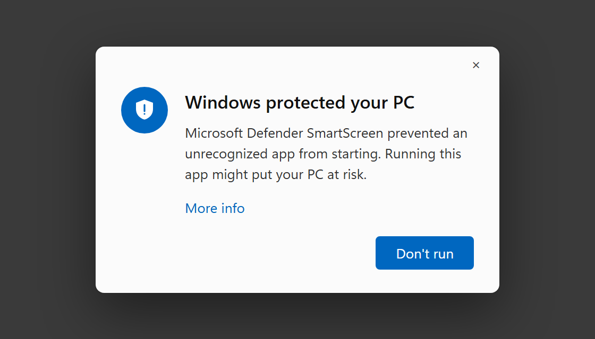
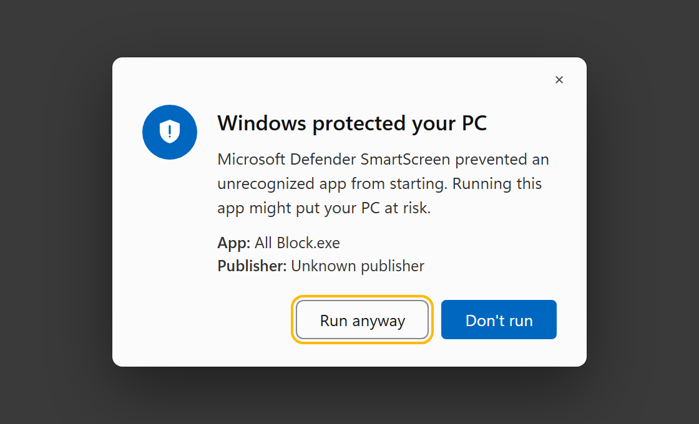
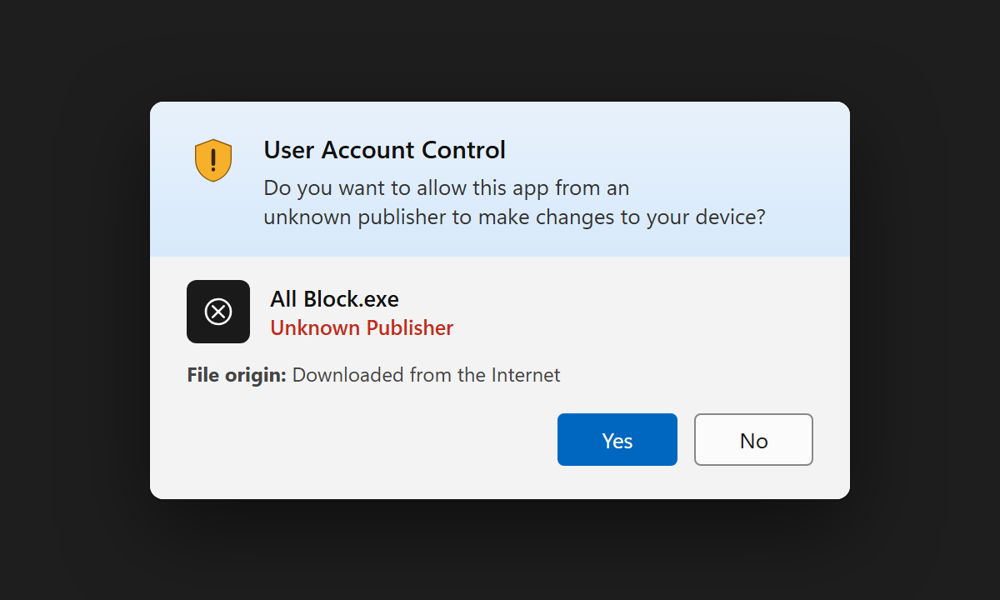

# All Block

**A ruthless FREE focus timer for Windows. Pick a duration, hit Start, and your keyboard and mouse are gone until the clock runs out.**

---

## Why All Block exists

Website blockers and app blockers are easy to argue with. You hit a paywall, you disable the extension, you're back on the site in ten seconds. All Block skips the negotiation: once a session starts, your mouse and keyboard stop working system‑wide, full stop, until the timer hits zero. There's no "just one more tab" — there's no input at all.

It's a single-purpose tool built around one idea: the only distraction blocker that actually works is one you can't casually click your way out of. Start a session and you're left with whatever isn't on a screen — a book, a walk, an actual conversation — until the timer decides otherwise.

All Block is completely free. It was inspired by Blockit, the Android app that does the same "lock yourself out" trick on phones — this is that idea, brought to Windows desktops.

**A free alternative to** [Cold Turkey Blocker](https://getcoldturkey.com/), [Freedom](https://freedom.to/), [FocusMe](https://focusme.com/), [Forest](https://www.forestapp.cc/), [SelfControl](https://selfcontrolapp.com/), [Opal](https://www.opal.so/), and [StayFocusd](https://chromewebstore.google.com/detail/laankejkbhbdhmipfmgcngdelahlfoji) — for people who want a hard lockout instead of a blocklist you can just click past.

## Screenshots

<table>
<tr>
<td align="center" width="50%">
 
Main screen — dark mode
</td>
<td align="center" width="50%">
 
Main screen — light mode
</td>
</tr>
<tr>
<td align="center" width="50%">
 
One-time setup wizard
</td>
<td align="center" width="50%">
 
Fullscreen lock, mid-session
</td>
</tr>
</table>

## Features

- **Hard input lock** — low-level `WH_KEYBOARD_LL` / `WH_MOUSE_LL` Windows hooks swallow every mouse and keyboard event system-wide for the duration of a session, not just inside the app.
- **Fullscreen countdown** — a distraction-free, always-on-top lock screen shows exactly how much time is left, and re-asserts itself instantly if anything (Alt-Tab, a touchpad gesture, a display change) tries to shove it aside.
- **Flexible durations** — a smooth scroll-wheel picker from 10 seconds up to 3 hours, so you can use it for a quick test run or a full deep-work block.
- **Resume on restart** — if a reboot or forced restart happens mid-session, All Block picks the countdown back up where it left off instead of silently letting you off the hook.
- **Follows your Windows theme** — launches in light or dark mode to match your system setting automatically, with an animated circular wipe if you switch it manually.
- **Runs completely offline** — no internet connection needed, ever. Every icon is hand-drawn on a canvas, every UI sound is synthesized in-process, and fonts are bundled — no network calls, no telemetry, nothing phoning home.

## How it works

All Block is a single-file Python desktop app built on `customtkinter`. When you start a session:

1. A fullscreen, always-on-top `Toplevel` window fades in and takes over the display.
2. `SetWindowsHookEx` installs low-level keyboard and mouse hooks that intercept and discard input before any other application (including Explorer) ever sees it. `BlockInput()` is layered on as a second line of defense.
3. A tick loop redraws the countdown, re-asserts topmost/fullscreen if the OS tries to demote the window, and re-arms the input hook every frame so a stray Ctrl+Alt+Del bounce can't sneak past it.
4. When the timer hits zero, the hooks are released and the lock window smoothly fades away.

The one thing that's deliberately left untouched is <kbd>Ctrl</kbd>+<kbd>Alt</kbd>+<kbd>Del</kbd> — Windows reserves that as a secure attention sequence no app can intercept, so there's always a way out to Task Manager if something goes wrong.

## Getting started

Download the latest `All Block.exe` from the [Releases](https://github.com/Auzeo/all-block/releases) page and run it — no install, no dependencies.

Right-click → **Run as Administrator** if you want website blocking and the strongest input lock — All Block still runs without it, just with a couple of protections skipped (the wizard will tell you exactly what's missing).

### Getting past the "Windows protected your PC" warning

All Block isn't code-signed (a certificate costs money All Block doesn't charge you for), so the first time you run a freshly downloaded copy, Windows will show its standard warning for unsigned apps. This is normal, not a sign anything is wrong — here's how to get past it:

<table>
<tr>
<td align="center" width="33%">
 
1. Click <b>More info</b>
</td>
<td align="center" width="33%">
 
2. Click <b>Run anyway</b>
</td>
<td align="center" width="33%">
 
3. Click <b>Yes</b> on the admin prompt
</td>
</tr>
</table>

(Illustrations of the real Windows 11 dialogs, recreated for clarity — the actual wording and layout on your PC will match.)

1. **"Windows protected your PC"** appears — this is Microsoft Defender SmartScreen flagging that the app has no publisher certificate, not that it detected anything malicious. Click **More info**.
2. The dialog expands to show the app name and "Unknown publisher." Click **Run anyway**.
3. Windows then asks to confirm the admin permissions the app needs (see [Why All Block exists](#why-all-block-exists) for what that's used for) — click **Yes**.

After the first run, Windows remembers your choice and won't ask again for that copy of the exe.

## Usage

1. Launch All Block.
2. Scroll (or drag, or use the arrow keys) the wheel to pick a duration.
3. Click **Start**.
4. Your input is gone. Go do the thing you were avoiding.

## Safety notes

All Block genuinely disables your mouse and keyboard for the length of a session — that's the entire point, so please use it deliberately:

- Start a session only when you're actually ready to lose input for that long.
- It's built and tested for solo, single-user desktops. It isn't designed as a parental-control or multi-user access-control tool.

## Tech stack

- **Python 3** + [`customtkinter`](https://github.com/TomSchimansky/CustomTkinter) for the UI
- **Win32 API** (via `ctypes`) for low-level input hooks, DWM window styling, and fullscreen placement
- **Pillow** for on-the-fly icon rendering, blurred/rotated wheel labels, and the theme-switch wipe animation
- **PyInstaller** for packaging a standalone Windows executable

## Credits

UI text is set in [Montserrat](https://github.com/JulietaUla/Montserrat) (SIL Open Font License).

Inspired by Blockit, the Android app that locks your phone during a session — All Block brings the same idea to Windows.

## License

All Rights Reserved. See [LICENSE](LICENSE). © Auzeo
