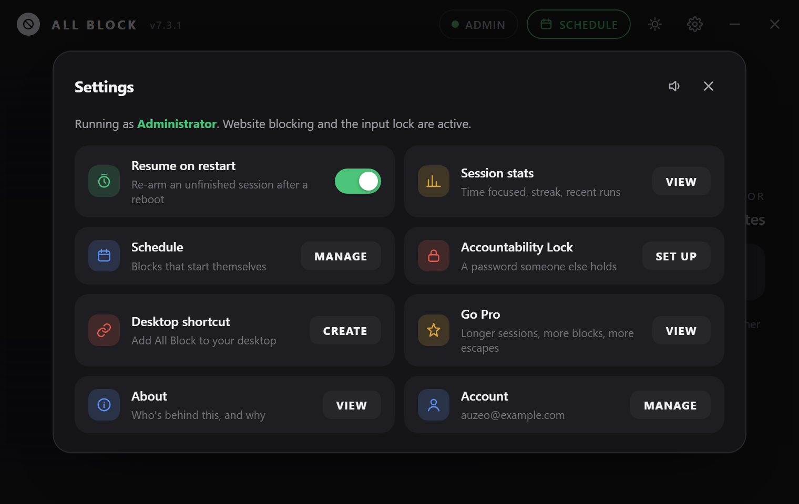

# The All Block

**A blocker you can't bypass — the whole device, not a list of apps. Pick a duration, hit Start, and your keyboard and mouse are gone until the clock runs out.**

---

## Why The All Block exists

Website blockers and app blockers are easy to argue with. You hit a paywall, you disable the extension, you're back on the site in ten seconds. The All Block skips the negotiation: once a session starts, your mouse and keyboard stop working system-wide, full stop, until the timer hits zero. There's no "just one more tab" — there's no input at all.

It's a single-purpose tool built around one idea: the only distraction blocker that actually works is one you can't casually click your way out of. Start a session and you're left with whatever isn't on a screen — a book, a walk, an actual conversation — until the timer decides otherwise.

**A free alternative to** [Cold Turkey Blocker](https://getcoldturkey.com/), [Freedom](https://freedom.to/), [FocusMe](https://focusme.com/), [LeechBlock](https://www.proginosko.com/leechblock/), and [StayFocusd](https://chromewebstore.google.com/detail/laankejkbhbdhmipfmgcngdelahlfoji) — for people who want a hard lockout instead of a blocklist you can just click past.

## Screenshots

<table>
<tr>
<td align="center" width="50%">
 
Main screen — dark mode
</td>
<td align="center" width="50%">
 
Main screen — light mode
</td>
</tr>
<tr>
<td align="center" width="50%">
 
One-time setup wizard
</td>
<td align="center" width="50%">
 
Settings
</td>
</tr>
<tr>
<td align="center" colspan="2">
 
Fullscreen lock, mid-session
</td>
</tr>
</table>

## Features

- **Hard input lock** — low-level Windows hooks swallow every mouse and keyboard event system-wide for the duration of a session, not just inside the app.
- **Fullscreen countdown** — a distraction-free, always-on-top lock screen shows exactly how much time is left, and re-asserts itself instantly if anything tries to shove it aside.
- **Scheduled blocks** — set recurring blocks that start themselves, so the session doesn't depend on you remembering to press Start.
- **Accountability Lock** — an optional password on schedule edits, so "just this once" takes more than one click to talk yourself into.
- **Survives restarts** — if a reboot or forced restart happens mid-session, The All Block picks the countdown back up where it left off instead of silently letting you off the hook.
- **Session history** — tracks focus time and streaks so progress isn't just a feeling.
- **Runs as administrator** — closes the "just kill it in Task Manager" escape hatch; Ctrl+Alt+Del is deliberately left alone, since Windows reserves that as a secure attention sequence no app can intercept.
- **Follows your Windows theme** — light or dark, matching your system setting automatically.

## Free vs. Pro

|  | Free | Pro — £2.99 one-time |
|---|---|---|
| Manual sessions | 10 seconds – 3 hours | Same, plus 4/6/8/12/24-hour options |
| Scheduled blocks | Up to 3 | Unlimited |
| Max scheduled block length | 3 hours | 24 hours |
| Emergency unlocks | 1 / month | 3 / month |

Manual sessions are always free — the cap only applies to *scheduled* blocks. Pro is a one-time purchase, not a subscription.

## Getting started

Download the latest `The All Block.exe` from the [Releases](https://github.com/Auzeo/all-block/releases) page and run it — no install required.

Right-click → **Run as Administrator** for website blocking and the strongest input lock — The All Block still runs without it, just with a couple of protections skipped (the wizard will tell you exactly what's missing).

### Getting past the "Windows protected your PC" warning

The All Block isn't code-signed (a certificate costs money The All Block doesn't charge you for), so the first time you run a freshly downloaded copy, Windows will show its standard warning for unsigned apps. This is normal, not a sign anything is wrong:

<table>
<tr>
<td align="center" width="33%">
 
1. Click <b>More info</b>
</td>
<td align="center" width="33%">
 
2. Click <b>Run anyway</b>
</td>
<td align="center" width="33%">
 
3. Click <b>Yes</b> on the admin prompt
</td>
</tr>
</table>

(Illustrations of the real Windows 11 dialogs, recreated for clarity — the actual wording and layout on your PC will match.)

1. **"Windows protected your PC"** appears — this is Microsoft Defender SmartScreen flagging that the app has no publisher certificate, not that it detected anything malicious. Click **More info**.
2. The dialog expands to show the app name and "Unknown publisher." Click **Run anyway**.
3. Windows then asks to confirm the admin permissions the app needs — click **Yes**.

After the first run, Windows remembers your choice and won't ask again for that copy of the exe.

## Safety notes

The All Block genuinely disables your mouse and keyboard for the length of a session — that's the entire point, so please use it deliberately:

- Start a session only when you're actually ready to lose input for that long.
- It's built and tested for solo, single-user desktops. It isn't designed as a parental-control or multi-user access-control tool.

## About

**A note from the developer:**

I tried pretty much every blocker out there, and always found a way to sneak past them once I'd started — so I built one myself that wouldn't let me, or at least make it not worth my effort to bypass.

Entire project was by one person, not a company or anything. Just a small-time Irish design and software engineer without a team or investors, so your support and feedback would mean so much.

Got an idea or spotted a bug? [Email me](mailto:MrAuzeo@protonmail.com?subject=All%20Block%20suggestion) — I'd love to hear it!

— Auzeo

## Support the project

The All Block ships free updates and support for both the free and Pro tiers. If you'd like to support development directly, the £2.99 Pro upgrade is the way to do that — it also unlocks longer sessions and unlimited scheduled blocks.

## License

All Rights Reserved. See [LICENSE](LICENSE). © Auzeo

Source code for this release is not published — see [LICENSE](LICENSE). The site in [`docs/`](docs) remains open so the download page and marketing site can be inspected or self-hosted.
